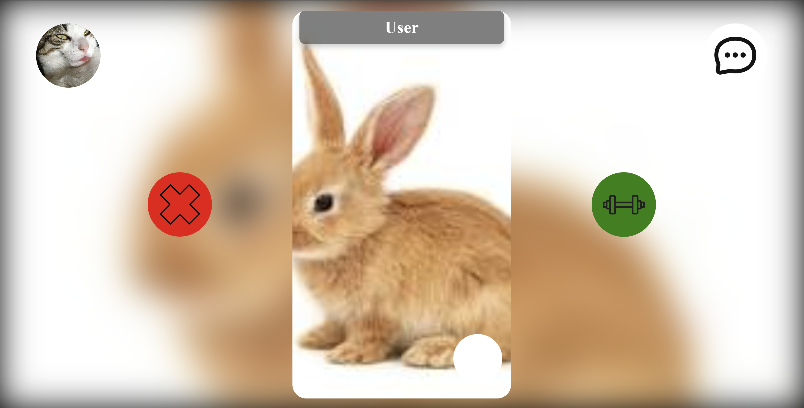

# Ball-s 🪢

Welcome to Ball's ! This project is a dating site for athletes



# Prerequisite ⏪

Somes knowledges in this field : 

- The use of Golang 
- The use of HTML, CSS and JavaScript
- The use of Git and for the code management

# Installation 🔧

1. Clone the repository.
```bash
  git clone https://github.com/MounKilian/Ball-s.git
```
2. Reach in the repository.
```bash
  cd Ball-s/server
```

# Start 🧑‍💻

1. Write theses commands: 
```bash
  go run ../dbp/main/main.go
```
```bash
  go run main.go
```

2. Your application running on port 8080 is available then you can open it in browser. 
If you don't have the message for open it you can write this in your browser:
```bash
  http://localhost:8080/
```

# How Play ? 🔨

You arrive on the login page if you are not already connected.
When you log in you will arrive on the home page where you can swipe.

When you swipe you can miss or strike. If two people strike there is a match. The two person can speak each other in the messaging.

You can see and manage your profile page if you click in your profile picture.

# Version 🗃️

golang 1.21.0

# Authors 💸

 - [Kilian Moun 🍻](https://github.com/MounKilian)
 - [Omar Yassine 🍻]
 - [Anthony Pereira 🍻]
 - [ 🍻]
